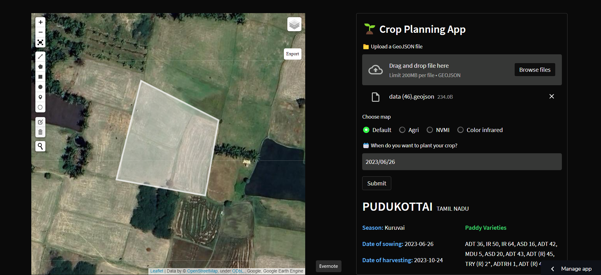
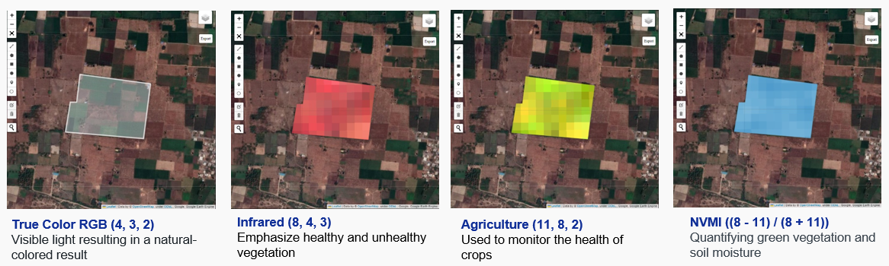

<br />
<div align="center">

  <h2 align="center">Hyperspectral Satellite Imagery Viewer and Harvest Planning App</h2>

  <p align="center">
    Secure, user-friendly and data-driven agriculture-based Streamlit app deployed on Streamlit Community Cloud/Azure App Service 
  </p>
    <a href="https://github.com/dnezan/streamlit-hyperspectral-agri">
    
</div>
</br>

*The project is still work in progress, see the [disclaimer below](#status).*

## Installation

Pip install all the package including in *requirements.txt* in a Python>=3.8 environment.
```sh
git clone https://github.com/dnezan/streamlit-hyperspectral-agri
pip install requirements.txt
```
To use your Google Earth Engine service account credentials, make sure to authenticate your access by using the code below, and add your credentials as Streamlit Secrets if you are deploying on Streamlit Community Cloud. You can also use Azure Key Vault if you are deploying on Azure.

```python
json_data = st.secrets["json_data"]
# Preparing values
json_object = json.loads(json_data, strict=False)
service_account = st.secrets["service_account"]
json_object = json.dumps(json_object)
# Authorising the app
credentials = ee.ServiceAccountCredentials(service_account, key_data=json_object)
ee.Initialize(credentials)
```

Replace your credentials as a **Secret** in TOML format.
```toml
json_data = { 
    "type": "service_account",
    "project_id": "****",
    "private_key_id": "****",
    "private_key": "****",
    "client_email": "****.iam.gserviceaccount.com",
    "client_id": "****",
    "auth_uri": "https://accounts.google.com/o/oauth2/auth",
    "token_uri": "https://oauth2.googleapis.com/token",
    "auth_provider_x509_cert_url": "https://www.googleapis.com/oauth2/v1/certs",
    "client_x509_cert_url": "****",
    "universe_domain": "googleapis.com"
     }

service_account = '****.iam.gserviceaccount.com'
```

## How does it work?

We are able to extract plot-specific data by geo-locating the plot using latitude and longitude information. We can gather weather data and forecasts from open-source APIs, such as OpenWeatherMap. We could also source agri-specific weather data such as leaf wetness from Indian state government websites, such as TAWN (TamilNadu Agriculture Weather Network). 

Our map data and hyperspectral satellite imagery is from a satellite called [LANDSAT-9](https://developers.google.com/earth-engine/datasets/catalog/landsat-9), a satellite launched by NASA which allows open access to its data. Its resolution is 30 meters. It circles the Earth every 16 days. If needed, we can also access 5-day data using Sentinel 2 satellite, but at a lower resolution.

**Hyperspectral satellite band explanations**

LANDSAT-9 satellite has 11 different bands, each of which contain specific data. Combinations of these bands can be used to infer different information about land, air and water.



*RGB*

This is Red-Green-Blue bands, which is used to show true color satellite imagery.

*Infrared*

The color infrared band combination is meant to emphasize healthy and unhealthy vegetation. By using the near-infrared (B8) band, it’s especially good at reflecting chlorophyll. This is why in a color infrared image, denser vegetation is red. But urban areas are white.

*Agriculture*

It’s mostly used to monitor the health of crops because of how it uses short-wave and near-infrared. Both these bands are particularly good at highlighting dense vegetation that appears as dark green. Yellow may also indicate presence of crop infestation or disease.

*NVMI*

The moisture index is ideal for finding water stress in plants. It uses the short-wave and near-infrared to generate an index of moisture content. In general, wetter vegetation has higher values. But lower moisture index values suggest plants are under stress from insufficient moisture.

We can then feed our hyper-local data to our fine-tuned LLM (Large Language Model) to infer further insights and provide them to end-users after transliteration and translation into their native language. We are planning on fine-tuning our LLM using a large corpus of sourced agri data from universities and Indian government institutions. We can also provide retailer information if we have recommendations for fertilisers/pesticides/irrigation requirements.

## Goals
**1. <u>Accessible**</u>

The application aims to provide users with an accessible and user-friendly interface. The layout is designed to be intuitive, with a map displayed on the left side and user input options on the right. Users have two primary actions they can take within the app. Firstly, they can access hyperspectral imagery to gain valuable crop advisory insights. This feature allows them to make informed decisions regarding their crops based on advanced imaging technology. Secondly, users can plan their harvest and explore different paddy hybrids suitable for their chosen season. In cases where the selected season is not favorable for their intended crops, the application will intelligently suggest alternative favorable seasons, ensuring users always have the best possible options at their disposal.

**2. <u>Integrated**</u>

The application is fully self-contained, providing users with a seamless experience. I prioritized integration within the app itself, minimizing the reliance on external sites or services. For instance, instead of depending on third-party platforms like [geojson.io](geojson.io) for plot outlining, our app offers an in-built solution. Users can conveniently outline their plots directly within the application and export the resulting vector file as a geojson file. This integration enhances user convenience, streamlining the entire workflow within a single environment.


**3. <u>Secure**</u>

We prioritize the security of our users' data and credentials. To ensure maximum protection, we have implemented stringent security measures. All user credentials are stored in a secure manner, eliminating the risk of unauthorized access. The application leverages robust technologies such as streamlit secrets and Azure Key Vault, depending on the chosen deployment. By adopting these industry-standard security practices, we provide users with peace of mind, knowing that their sensitive information is handled with the utmost care.

**4. <u>Versatile**</u>

Our application offers a wide range of functionalities, making it highly versatile for users. With our app, you can perform various tasks and actions, tailored to meet your specific needs. Whether you are seeking crop advisory insights through hyperspectral imagery or planning your harvest with access to diverse paddy hybrids, our application caters to your requirements. The versatility of the app ensures that users have comprehensive tools at their disposal, empowering them to make informed decisions and optimize their agricultural practices efficiently.
you can perform multiple functions and the app is very versatile.


## Status

As of <u>June 26, 2023</u>, the app is live on Streamlit community Cloud and the demo can be accessed by clicking on this **[link](https://agritech-crop-app.streamlit.app/)**. It has also been deployed on Azure as an app service. Keeping in mind I am utilising the free tier of Streamlit Community Cloud, I cannot guarantee that the application will remain accessible indefinitely.

Please keep in mind the app only covers districts from **Tamil Nadu** scraped from the [TNAU portal](http://www.agritech.tnau.ac.in/expert_system/paddy/seasonvariety.html) georeferenced from ISRO's [Bhuvan](https://bhuvan-app1.nrsc.gov.in/state/PB) state/district boundary data, which was cleaned and exported using [QGIS](https://www.qgis.org/en/site/). Functionality can be extended by scraping additional district-wise data from other state-specific data repositories.

> **Note**
> 
> Kindly be advised that the utilization of LANDSAT-9 satellite imagery in this project is facilitated through `Google Earth Engine`. Please note that access to this imagery necessitates the utilization of a designated service account.

